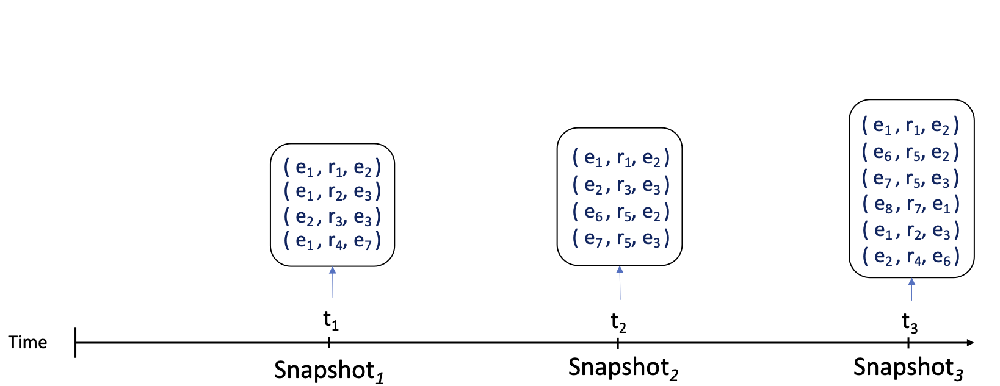
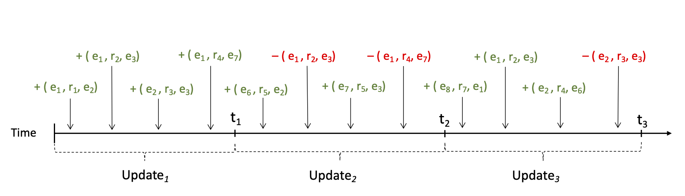
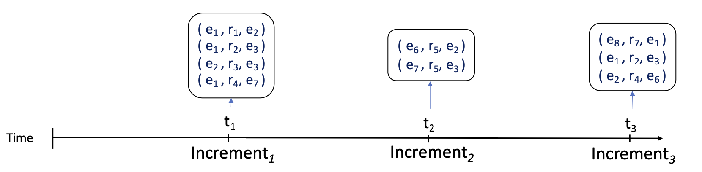
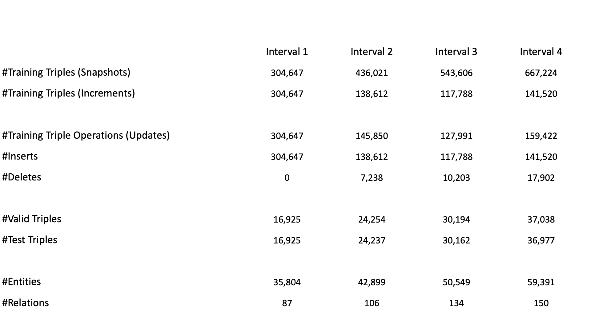
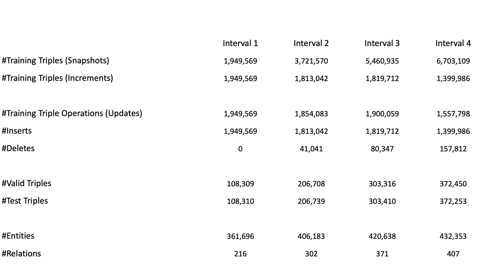

# WikidataEvolve
WikidataEvolve is a benchmark dataset for knowledge graph embedding and is based on the Wikidata9M dataset representing an evolving knowledge graph by a time stream of triple operations. WikidataEvolve describes a division of Wikidata9M into 4 intervals and provides training and test data for each interval. In this way, knowledge graph embedding techniques can be trained and evaluated along the intervals, in order to assess and compare their performances over time.


Basically, WikidataEvolve is the first benchmark dataset which allows to adequately evaluate inductive (also reffered to as incremental) knowledge graph embedding techniques in context of an evolving knowledge graph. 
There are a variety of other benchmarks constituting an evolving knowledge graph (e.g. DBpedia-3SP, YAGO-3SP, etc.). However, all of these benchmarks rely on an unchanging set of training examples throughout their graph evolutions. In this way, inductive embedding techniques are evaluated repeatedly on the same test exmaples. This might be sufficient for the evaluation of transductive (also reffered to as static) knowledge graph embedding techniques.
Concerning the evaluation of inductive embedding techniques, it should rather be examined how they perform in learning facts that have been inserted into and unlearning facts that have been removed from the knowledge graph. Drawing on an unchanging test data, these benchmarks completely neglect these investigation points. 

WikidataEvolve, in contrast, consists of training and test datasets that evolve organically along the evolution of the knowledge graph.
The corresponding test data can be used to conduct the tasks of link prediction [1] and triple classification [2] after each interval.  
A new evaluation scenario I developed during my master's thesis is the task of Negative Triple Classification. It is mainly designed for inductive knowledge graph embedding models. Similar to triple classification, it describes a binary classification task and examines the capability of inductive knowledge graph embedding techniques to learn facts that have been inserted and unlearn facts that have been removed from the knowledge graph. Accordingly, the benchmark provides test examples that assigne the triples of the knowledge graph to 3 categories after each interval with respect to their current change history. One of these categories, for instance, collects facts which emerged in the knowledge graph and have been deleted afterwards.
Now, an inductive embedding model is subjected to classify these deleted facts in order to measure to which extent it attained to unlearning them. For a detailed task description, I encourage you to review section 5 of my master's thesis.


## Data Description
As WikidataEvolve is based on the evolving knowledge graph of Wikidata9M it comprises training, validation and test data which 
organically evolve altogether with the graph. They are not only suitable for applying inductive embedding techniques but also allow to
include transductive (also reffered to as static) knowledge graph embedding techniques into the evaluation frame.

### Training Data
As Wikidata is compatible with different types of knowledge graph embedding techniques, the training data is supplied in different formats. These formats include (knowledge graph) snapshots, updates, and increments.

#### Snapshots
Snapshots describe the time states of a knowledge graph encoded by a set of triples. They are tailored for transductive knowledge graph embedding techniques (e.g. TransE, TransH, RESCAL), which are required to scan all entities, relations and facts existing in the knowledge graph at training time.

<p align="center">
   
</p>   

<p align="center" style="font-family:Monospace">
   Figure 1: Illustration of the snapshots of a sample evolving knowledge graph.
</p>
<br>
   


#### Updates
Updates, in turn, document the atomic changes made to the knowledge graph during the graph evolution. They are represented by a sequence of triple operations indicating which triple was added or removed from the graph. Insofar, the logical relation between a snapshots and a update is that a snapshot is the resulting state of the knowledge graph after it has been manipulated by an update. Updates are suited for inductive (also reffered to incremental) knowledge graph embedding techniques (e.g. PuTransE, DKGE), which preserve their interimly learned representations and update them with respect to the changes made to the knowledge graph. 

<p align="center">
   
</p>

<p align="center" style="font-family:Monospace">
   Figure 2: Illustration of the updates of a sample evolving knowledge graph.
</p>
<br>


#### Increments
Now, the increments of a knowledge graph (likewise snapshots) are also represented by a set of triples but only contain triples that recently have been added to the graph. Hence, they can be understood by the delta between two consecutive snapshots. Increments are related to a learning variant for transductive knowledge graph embedding techniques characterized as pseudo-incremental. In the literature it is often stated that static embedding techniques, like TransE for instance, are required to learn their representations from scratch after their represented knowledge graph has been altered.
Now this is a time- and space-consuming process—especially in highly dynamic knowledge domains. Therefore I examined to which degree static embedding techniques lose their predictive performance by preserving their entity and relation representations throughout the WikidataEvolve dataset and continue to learn them on the increments of the knowledge graph. By doing so, I measured the trade-off between the efficiency enabled by an pseudo-incremental learning variant only optimizing its embeddings on the graph's increments and the predictive power of a static embedding model forming its embedding repeatedly from scratch on the entire knowledge graph.  

<p align="center">
   
</p>

<p align="center" style="font-family:Monospace">
   Figure 3: Illustration of the increments of a sample evolving knowledge graph.
</p>
<br>

### Evaluation Data
All types of embedding techniques are provided with the same test datasets, in order to make their evaluation performances comparable.
Furthermore, inductive embedding techniques are provided with test samples to subject them to Negative Triple Classification. Thereby, for each category of Negative Triple Classification the related samples are provided in separate files.


## Filtering process

For the compilation process of WikidataEvolve a filtering process was conducted. It is inspired by [3] in which the authors compiled
the FB15k benchmark by filtering entities and relations which have a minum number of fact occurences in the knowledge graph to reduce noise. In this way it is faciliated that knowledge graph embedding techniques can capture enough relational information to learn representations for the entities and relations of a knowledge graph. Transferred to the filtering process of WikidataEvolve, I performed a snapshot-centric filtering. This means that entities and relations are considered which possess a minimum frequency of 15 fact occurences for relations and 70 fact occurences for entities after they emerge in the graph for the first time. 

## Benchmark Details

Here, you can see the details of the officially released WikidataEvolve dataset relying on filtering and a raw version of WikidataEvolve compiled without filtering.
As the raw version contains files which exceeding the file size limit of github it was not able to upload this version. By using the mentioned script
a raw version of WikidataEvolve can be compile. Be aware that the frequencies in the table below might vary, as the compilation process partially is influenced by chance.

<p align="right">
   
</p>

<p align="center" style="font-family:Monospace">
   Table 1: Details of the official (filtered) version of WikidataEvolve.
</p>

<br>
<br>


<p align="center">
   
</p>

<p align="center" style="font-family:Monospace">
   Table 2: Details of the raw version of WikidataEvolve.
</p>
<br>


## Executable Script

To compile WikidataEvolve I wrote the script 'wikidata_evolve_builder.py' which divides Wikidata9M into n equal-sized intervals containing the same number of triple operations to compile training and test data for each interval. The official version counts 4 intervals. 
As Wikidata9M represents a knowledge graph evolution, a major challenge in the compilation process has been to split the Wikidata9M time stream into intervals, perform a train and test split and to simultaneously ensure that the training and test data are disjunctive throughout the graph evolution. 
For details of the compilation algorithm I encourage you to review the mentioned script; for a more abstract description I encourage you to review the algorithms 2 and 3 of my master's thesis at https://github.com/rlafraie/masters-thesis.

'wikidata_evolve_builder.py' allows you to compile another version of WikidataEvolve for your own needs. 
First, go to the folder of your local repository copy and install the required python modules from the command line.

```bash
$ pip install -r requirements.txt 
```

Afterwards, you can execute the script directly from the command line.

```bash
$ python wikidata_evolve_builder.py 
```

The script prompts you to provide 3 inputs in the following order:

1) Specify the number of intervals used to divide the Wikidata9M time stream and resulting in the equivalent number of snapshots, updates, increments.
2) Answer with y (yes) or n (no) whether you want to filter entities and relations with a minimum number of fact occurences at all snapshots.
3) Specify the number of test examples in the test samples. If you test samples are not needed leave this prompt blank and only test datasets will be compiled.

## Benchmark Folder Structure
```txt
root/datasets/WikidataEvolve/[ filtered | raw ]_version_[ <timestamp> ]
   │
   ├── entity2id.txt            # Map of wikidata item identifiers to enumerated identifiers)
   ├── relation2id.txt.         # Map of wikidata property identifiers to enumerated identifiers)
   ├── mapped_triple-op2id.txt  # Sequence of triple operations including the mapped identifiers)
   │
   │
   ├── increments
   │   │
   │   ├── entity2id.txt        # Map of wikidata item identifiers to enumerated identifiers)
   │   ├── relation2id.txt      # Map of wikidata property identifiers to enumerated identifiers)
   │   └── <interval index>  : [ 1 | 2 | 3 | 4 ]
   │       │
   │       ├── global_triple2id.txt    # Set of all triples currently existing in the knowledge graph.
   │       │
   │       ├── train2id.txt             # Training Increment: Set of training triples which have been added to the graph.
   │       │
   │       ├── test2id_all.txt          # Set of triples used for testing a knowledge graph embedding technique.
   │       ├── test2id.txt              # Set of test triples sampled from 'test2id_all.txt'technique.
   │       ├── valid2id_all.txt         # Set of triples used for validating a knowledge graph embedding technique.
   │       └── valid2id.txt             # Set of validation triples sampled from 'valid2id_all.txt'technique.
   │
   ├── snapshots
   │   │
   │   └── <interval index>  : [ 1 | 2 | 3 | 4 ]
   │       │   
   │       ├── entity2id.txt        # Mapping files of entities and relations from their global identifiers (applying to the 
   │       ├── relation2id.txt.       entire WikidataEvolve evolution) to local (i.e. snapshot-bounded) identifiers.
   │       │ 
   │       ├── global_triple2id.txt # All triples existing in the knowledge graph at the corresponding snapshot. Encoded by global identifiers.
   │       ├── triple2id.txt        # All triples existing in the knowledge graph at the corresponding snapshot. Encoded by local identifiers.
   │       │
   │       ├── train2id.txt         # Training Snapshot: Set of training triples at the current snapshot.
   │       │
   │       ├── test2id_all.txt      # Set of triples used for testing a knowledge graph embedding technique. Encoded by local identifiers.
   │       ├── test2id.txt          # Set of test triples sampled from 'test2id_all.txt'technique. Encoded by local identifiers.
   │       ├── valid2id_all.txt     # Set of triples used for validating a knowledge graph embedding technique.
   │       └── valid2id.txt         # Set of validation triples sampled from 'valid2id_all.txt'technique.
   │
   └── updates
        │
        ├── entity2id.txt         # Map of wikidata item ids to enumerated ids
        ├── relation2id.txt       # Map of wikidata property ids to enumerated ids
        └── <interval index>  : [ 1 | 2 | 3 | 4 ]
           │
           ├── global_triple2id.txt     # Set of all triples currently existing in the knowledge graph.
           ├── triple-op2id.txt         # Update of the knowledge graph represented by triple operations
           │
           ├── train-op2id.txt          # Training Update: triple operations related to the training data of the knowledge graph.
           │
           ├── test2id_all.txt          # Set of triples used for testing a knowledge graph embedding technique. Encoded by local identifiers.
           ├── test2id.txt              # Set of test triples sampled from 'test2id_all.txt'technique. Encoded by local identifiers.
           ├── valid2id.txt             # Set of triples used for validating a knowledge graph embedding technique.
           ├── valid2id_all.txt         # Set of validation triples sampled from 'valid2id_all.txt'technique.
           │
           ├── triple_classification_test_examples.txt      # Test examples to evaluate inductive knowledge graph embedding techniques  
           │                                                # in the task of triple classification.
           │
           ├── tc_negative_deleted_[ train | valid | test ]_triples.txt        # Test examples for negative triple classification separately stored for
           ├── tc_positive_oscillated_[ train | valid | test ]_triples.txt     # each category and source dataset. For a detailed task description, I 
           └── tc_negative_oscillated_[ train | valid | test ]_triples.txt     # refer to section 5 of my master's thesis.
```

## References
<a id="1">[1]</a> 
Antoine Bordes, Jason Weston, Ronan Collobert, and Yoshua Bengio. Learning structured embeddings of knowledge bases. In AAAI. AAAI Press, 2011.

<a id="1">[2]</a> 
Richard Socher, Danqi Chen, Christopher D. Manning, and Andrew Y. Ng. Reason- ing with neural tensor networks for knowledge base completion. In NIPS, pages 926–934, 2013.

<a id="1">[3]</a> 
Antoine Bordes, Nicolas Usunier, Alberto García-Durán, Jason Weston, and Oksana Yakhnenko. Translating embeddings for modeling multi-relational data. In NIPS, pages 2787–2795, 2013.
